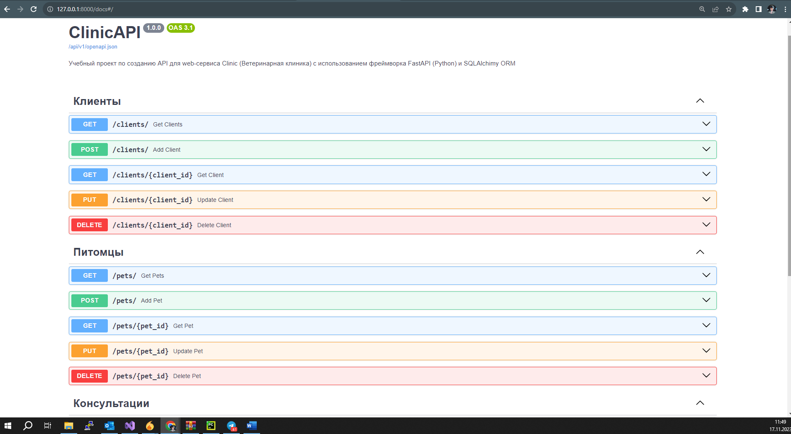
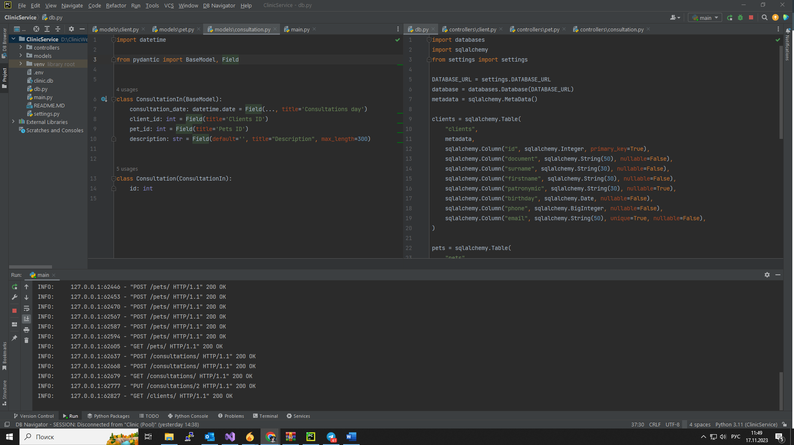

# Архитектура ПО (семинары)

------

## Урок 10. Структура приложения с пользовательским интерфейсом и базой данных (паттерн Repository)
### По возможности доработать наш WEB API сервис с использованием шаблона Repository. Добавить 1-2 контроллера, протянуть взаимодействие с БД как мы это выполнили на примере репозитория ClientRepository и контроллера ClientController. 
### Если вам некомфортно работать в рамках языка C#, вы можете использовать любой язык и технологию для выполнения вашего домашнего задания, главное, продемонстрировать работу шаблона репозитория в рамках вашего приложения.
### Данный проект я реализовала с помощью фреймворка FastAPI (Python) и SQLAlchemy ORM (создание Sqlite БД clinic.db). Структура создания БД описана в модуле [**db.py**](db.py "Ссылка на файл")
### В проекте создано 3 контроллера [**client.py**](controllers/client.py "Ссылка на файл"), [**pet.py**](controllers/pet.py "Ссылка на файл"), [**consultation.py**](controllers/consultation.py "Ссылка на файл"). Все они находятся в пакете [**controllers**](controllers "Ссылка на пакет")
### Одноименные модели проекта расположены в пакете [**models**](models "Ссылка на пакет")

----------

_____

### Точка входа реализована в [**main.py**](main.py "Ссылка на файл")
### Для данного проекта потребовались библиотеки, перечисленные в [**requirements.txt**](requirements.txt "Ссылка на файл"). Для быстрой установки необходимо выполнить команду:
    pip install -r requirements.txt  